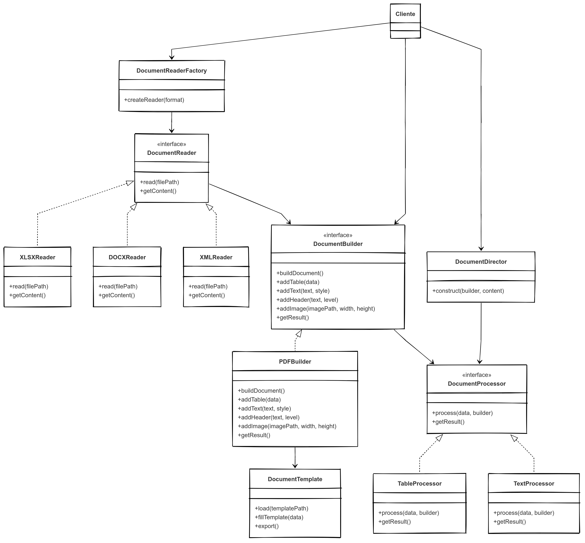

# Análisis del problema
## Para este sistema necesitamos

- Trabajar con diferentes formatos de entrada (XLSX, DOCX, XML)
- Generar documentos PDF con elementos complejos
- Mantener una arquitectura extensible y flexible
- Abstraer los detalles de implementación del cliente

## Patrones de diseño seleccionados
Para esta solución utilizaré principalmente los siguientes patrones:

- Patrón Factory Method/Abstract Factory: para crear los objetos de procesamiento específicos del formato.
- Patrón Builder: para crear documentos PDF complejos de forma flexible.
- Patrón Adapter: Para adaptar diferentes formatos de entrada a una estructura común.
- Patrón Strategy: Para habilitar diferentes estrategias de procesamiento.

## Diagrama UML

# Explicación de la solución
## 1. Patrones implementados
### Patrón Factory Method (DocumentReaderFactory)
Este patrón nos permite crear diferentes tipos de lectores de documentos (XLSXReader, DOCXReader, XMLReader) sin exponer la lógica de creación al cliente. La ventaja es que podemos agregar nuevos formatos simplemente creando nuevas clases que implementen la interfaz DocumentReader y actualizando la fábrica.
### Patrón Builder (DocumentBuilder y PDFBuilder)
El patrón Builder permite construir documentos PDF complejos paso a paso. El PDFBuilder proporciona métodos como addTable(), addText(), etc., que permiten construir el documento de manera flexible y configurarlo según las necesidades específicas.
### Patrón Strategy (DocumentProcessor)
Las diferentes estrategias de procesamiento (TableProcessor, TextProcessor) permiten aplicar diferentes operaciones a las partes del documento. Esto posibilita, por ejemplo, procesar tablas y texto de manera diferente.
### Patrón Template Method (DocumentTemplate)
La clase DocumentTemplate proporciona un esqueleto para el proceso de generación de documentos a partir de plantillas, permitiendo personalizar ciertos pasos mientras mantiene la estructura general.

## 2. Flujo de trabajo

- El cliente solicita un lector de documento específico mediante DocumentReaderFactory
- El lector apropiado lee el documento de origen y extrae su contenido
- El DocumentBuilder construye el documento PDF utilizando los datos extraídos
- Los diferentes procesadores (TableProcessor, TextProcessor) procesan partes específicas del documento
- El DocumentDirector coordina el proceso de construcción
Opcionalmente, se puede utilizar una plantilla para generar el PDF

## 3. Beneficios de este diseño

- Extensibilidad: Se pueden agregar nuevos formatos implementando nuevas clases Reader sin modificar el código existente.
- Flexibilidad: Los documentos pueden construirse de manera dinámica y personalizada.
- Separación de responsabilidades: Cada componente tiene una responsabilidad clara y específica.
- Abstracción: El cliente no necesita conocer los detalles de implementación de la lectura/escritura de documentos.

## Funcionalidades clave de la implementación
### 1. Manejo de diferentes formatos de origen
La solución permite leer documentos en diferentes formatos (XLSX, DOCX, XML) a través de clases específicas que implementan la interfaz DocumentReader. La fábrica DocumentReaderFactory se encarga de crear el lector apropiado según el formato seleccionado.
### 2. Construcción flexible de documentos
El patrón Builder (PDFBuilder) permite construir documentos complejos de manera programática, agregando elementos como tablas, texto, encabezados e imágenes según sea necesario en tiempo de ejecución.
### 3. Extensibilidad
Para soportar un nuevo formato, solo es necesario:

Crear una nueva clase que implemente DocumentReader
Agregar una nueva opción en el método createReader() de DocumentReaderFactory

### 4. Abstracción para el cliente
El cliente de la aplicación no necesita conocer los detalles de cómo se lee cada formato o cómo se construye el PDF. Simplemente selecciona el formato, proporciona la ruta al archivo y obtiene el documento resultante.
### 5. Soporte para plantillas
La clase DocumentTemplate permite cargar plantillas predefinidas y llenarlas con datos específicos, facilitando la generación de documentos con formatos estándar.

# Conclusión
La solución propuesta utiliza varios patrones de diseño para crear un sistema flexible y extensible para la generación de documentos PDF a partir de diferentes formatos de origen. Los patrones Factory, Builder, Strategy y Template Method trabajando juntos permiten satisfacer todos los requisitos del problema de manera elegante y mantenible.
La arquitectura está diseñada para ser fácilmente extensible, permitiendo agregar nuevos formatos de entrada o nuevas funcionalidades sin modificar el código existente, siguiendo el principio Open/Closed de SOLID.